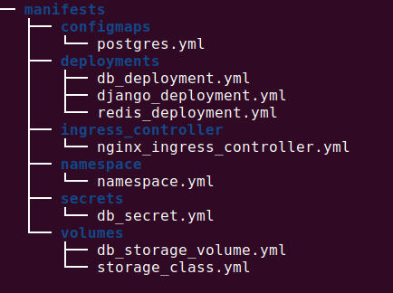

# Compredict_challenge
Compredict challenge work


# Task 1:


## Folder structure


<p align="center">
  <a>
    
  </a>
</p>


## Steps to reproduce the work
1. Create a namespace: to isolate the application
```sh
kubectl apply -f namespace/namespace.yml
```
2. Create the storage class

```sh
kubectl apply -f volumes/storage_class.yml
```
3. Create the volume
```sh
kubectl apply -f volumes/db_storage_volume.yml
```
4. Apply postgres database ConfigMap file
```sh
kubectl apply -f configmaps/postgres.yml
```
5. Apply the postgres database secret file
```sh
kubectl apply -f secrets/db_secret.yml
```
6. Deploy the database

```sh
kubectl apply -f deployments/db_deployment.yml
```
7. Deploy Redis

```sh
kubectl apply -f deployments/redis_deployment.yml
```
8. Deploy the app 

```sh
kubectl apply -f deployments/redis_deployment.yml
```
9. Expose the django app to the public using ingress 

* Install helm3 if it is not already installed 
```sh
wget https://get.helm.sh/helm-v3.0.1-linux-amd64.tar.gz
tar -zxvf helm-v3.0.1-linux-amd64.tar.gz
sudo mv linux-amd64/helm /usr/local/bin/helm3
```
* Setup ingress-nginx official repository

```sh
helm3 repo add ingress-nginx https://kubernetes.github.io/ingress-nginx
helm3 repo update
```
* Execute the nginx's chart
```sh
helm3 install nginx ingress-nginx/ingress-nginx\
	--namespace conpredict-task\
	--set rbac.create=true\
	--set controller.publishService.enabled=true
```
* Create the nginx resource 
```sh
kubectl apply -f ingress_controller/nginx_ingress_controller.yml
```

# Task 2:


## Folder structure

## Steps to reproduce the work


# Assignement 

# Objective:


## Task 1

Submit the kubernetes yaml files that do the following:
Deploy an empty Django application in two or more instances using kubernetes. 
The application is composed of the following services: 

Eventually, you should specify the order on how to apply the manefists with command `kubectl apply -f <manifest.yaml>`:


## Services

- Django (Deployment):
	- image: alang/django but you need to take care of gunicorn or write your own dockerfile.
	- 2 replicas
	- restart policy on failure max 3 times
	- Create ingress rule to expose the application the application.
	- Rollout update policy should be handled as 2 replicas should be up all time. (configure MaxSurge and availability in manefist)

- redis (Deployment):
	- image: redis:3.2
	- no public ports
	- on backend network
	- 1 replica
	- restart policy on failure max 3 times

- db (StatefulSet):
	- image: postgres:12.3
	- no public ports
	- on backend network
	- 1 replica
	- set username, database and port as ConfigMaps where as the password as Secret (use dataString).
	- Use Dynamic Volume Provisioning to create a volume for postgres and mount it to /var/lib/postgresql/data 


P.S: You can use Docker Desktop or the [play-with-kubernetes](https://labs.play-with-k8s.com/) to have multiple instances to test your script or use free AWS instances.


## Task 2

Write a python script that uses [kubernetes-python](https://github.com/kubernetes-client/python) SDK or any [other sdks](https://kubernetes.io/docs/reference/using-api/client-libraries/) 
to create a new Pod programatically or scale one of the services in Task 1.


## Submission

Please submit both task 1 and task 2 as zip file by email. If the zip file is too big, then put it on a cloud storage and provide us with the link. Otherwise, you can push the solution to github and pass over the link.
